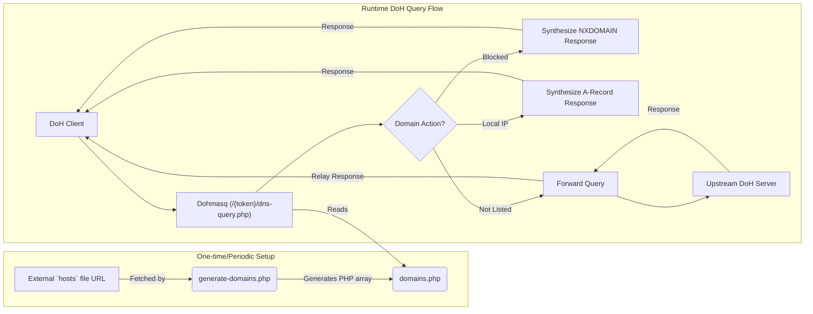

# Dohmasq

軽量で `Dnsmasq` にインスパイアされた、PHP で書かれた DNS-over-HTTPS (DoH) プロキシです。

`Dohmasq` は、ドメインのブロック、ドメインのローカル IP アドレスへの解決、および他のリクエストをアップストリームの DoH リゾルバに転送できるシンプルな DoH プロキシを提供します。これは、標準的な PHP ウェブサーバー上で簡単に設定および構成できるように設計されています。

## 特徴

*   **DNS-over-HTTPSプロキシ:** 暗号化された DNS クエリを処理する DoH サーバーとして機能します。
*   **ユーザー識別:** URL内のトークンによってユーザーを区別します (`https://your-domain.com/{token}/dns-query.php`)。
*   **ローカル DNS 解決:** 従来の `/etc/hosts` ファイルのように、特定のドメインをローカル IP アドレスに解決します。
*   **ドメインブロッキング:** `hosts` 形式のリストを使用して、不要なドメイン（広告、トラッカーなど）をブロックします。`0.0.0.0` を指すドメインは、`NXDOMAIN` 応答で自動的に拒否されます。
*   **アップストリーム転送:** ローカルリストにないドメインへのクエリは、設定可能なアップストリームの DoH サーバー（デフォルトは Google DNS）に転送されます。

## 仕組み

ここにアーキテクチャを示す図があります。



このプロジェクトには主に2つの部分があります。

1.  **ドメインリストジェネレーター (`generate-domains.php`):**
    これは、ドメインリストを構築するために一度（または定期的に）実行するコマンドラインスクリプトです。指定された URL から `hosts` 形式のファイルをフェッチし、解析して、`domains.php` にPHP配列を作成します。
    *   `0.0.0.0` にマッピングされたドメインはブロック対象としてマークされます。
    *   その他の IP にマッピングされたドメインは、ローカル解決のために保存されます。

2.  **DoH プロキシ (`dns-query.php`):**
    これはウェブのエントリーポイントです。URLパスにユーザー固有のトークン (`/{token}/dns-query.php`) が必要です。DoH クエリを受信すると、`DohProxy` クラスは次のように動作します。
    *   要求されたドメインが `domains.php` マップにあるかどうかを確認します。
    *   **ローカル解決の場合:** 指定された IP アドレスを持つ合成 `A` レコードを返します。
    *   **ブロック対象の場合:** `NXDOMAIN`（存在しないドメイン）応答を返します。
    *   **リストにない場合:** 生のクエリをアップストリームの DoH リゾルバに転送し、応答をクライアントに中継します。

## はじめに

### 前提条件

*   PHP 8.3 以降を推奨
*   依存関係管理のための [Composer](https://getcomposer.org/)
*   ウェブサーバー (Apache または Nginx など)

### インストール

1.  **リポジトリをクローンします:**
    ```bash
    git clone https://github.com/your-username/dohmasq.git
    cd dohmasq
    ```

2.  **依存関係をインストールします:**
    ```bash
    composer install
    ```

### 設定

1.  **ドメインリストの生成:**
    *   テキストエディタで `generate-domains.php` を開きます。
    *   使用したい `hosts` ファイルのURLに `$hostsUrl` 変数を変更します。
    *   ターミナルからスクリプトを実行します。
        ```bash
        php generate-domains.php
        ```
    *   これにより、ルールを含む `domains.php` ファイルが作成されます。

2.  **許可されたトークンの設定:**
    *   テキストエディタで `tokens.php` を開きます。
    *   DoH プロキシへのアクセスを許可したいすべてのトークンを含む PHP 配列を編集します。各トークンは一意の文字列である必要があります。
    *   例:
        ```php
        return [
            'my-personal-token',
            'family-token-123',
        ];
        ```

3.  **ウェブサーバーの設定:**
    `/{token}/dns-query.php` へのリクエストを `dns-query.php?token={token}` に書き換える必要があります。

    **Apache の場合:**
    同梱されている `.htaccess` ファイルが自動的にこれを処理します。

    ```apache
    RewriteEngine on
    RewriteBase /
    RewriteRule ^([a-zA-Z0-9_-]+)/dns-query\.php$ dns-query.php?token=$1 [END,QSA]
    RewriteRule ^([a-zA-Z0-9_-]+)/mobileconfig\.php$ mobileconfig.php?token=$1 [END,QSA]
    RewriteRule .* - [F]
    ```

    Apache サーバーが `.htaccess` のオーバーライドを許可していることを確認してください（バーチャルホスト設定で `AllowOverride All`）。

    **Nginx の場合:**
    この設定は、トークン化されたエンドポイントのみを許可し、他のすべてのリクエストを拒否することで、`.htaccess` の動作を模倣します。
    ```nginx
    # トークン化された dns-query.php へのアクセスを許可
    location ~ /([a-zA-Z0-9_-]+)/dns-query\.php$ {
        try_files $uri /dns-query.php?token=$1&$args;
    }

    # トークン化された mobileconfig.php へのアクセスを許可
    location ~ /([a-zA-Z0-9_-]+)/mobileconfig\.php$ {
        try_files $uri /mobileconfig.php?token=$1&$args;
    }

    # 他のすべてのリクエストを拒否
    location / {
        deny all;
    }
    ```

## 使用方法

設定が完了したら、デバイスやブラウザを新しい DoH サーバーを使用するように構成できます。URL は次のようになります。

`https://your-domain.com/{your-token}/dns-query.php`

`your-domain.com` を実際のサーバーのドメインに、`{your-token}` を `tokens.php` で設定した *許可されたトークン* のいずれかに置き換えてください。

### Apple デバイスの設定 (.mobileconfig)

Apple デバイス (iOS, iPadOS, macOS) の場合、`mobileconfig.php` ファイルを使用して構成プロファイルを生成できます。

1.  **プロファイルのダウンロード:**
    *   `mobileconfig.php` をウェブサーバーでホストします。
    *   Apple デバイスで、`mobileconfig.php` がホストされている URL（例: `https://your-domain.com/{your-token}/mobileconfig.php`）にアクセスします。`{your-token}` はあなたが選択したトークンに置き換えてください。

2.  **プロファイルのインストール:**
    *   画面の指示に従って構成プロファイルをダウンロードし、インストールします。
    *   これにより、デバイスが Dohmasq サーバーを DNS-over-HTTPS に使用するように自動的に設定されます。
