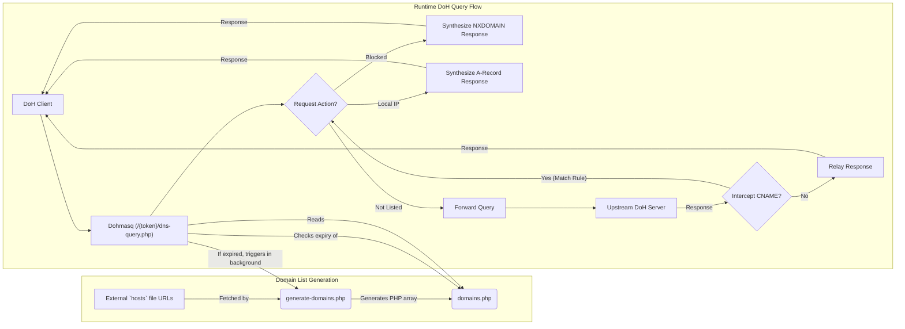

# Dohmasq

A lightweight, `Dnsmasq`-inspired DNS-over-HTTPS (DoH) proxy written in PHP.

`Dohmasq` provides a simple DoH proxy that can block domains, resolve domains to local IP addresses, and forward other requests to an upstream DoH resolver. It is designed to be easy to set up and configure on a standard PHP web server.

## Features

*   **DNS-over-HTTPS Proxy:** Acts as a DoH server to handle encrypted DNS queries.
*   **User Distinction:** Differentiate users by a token in the URL (`https://your-domain.com/{token}/dns-query.php`).
*   **Local DNS Resolution:** Resolve specific domains to local IP addresses, similar to a traditional `/etc/hosts` file.
*   **Domain Blocking:** Block unwanted domains (e.g., ads, trackers) by using a `hosts`-formatted list. Domains pointing to `0.0.0.0` are automatically rejected with an `NXDOMAIN` response.
*   **Upstream Forwarding:** Forwards any queries for domains not in the local list to a configurable upstream DoH server (defaults to Google DNS).
*   **CNAME Interception:** Even if a domain is not directly in the local list, if an upstream response contains a CNAME record pointing to a blocked or locally-resolved domain, `Dohmasq` will intercept and apply the local rule.
*   **Automatic List Updates:** Automatically regenerates the domain list (e.g., daily) to keep it fresh.

## How It Works

Here is a diagram illustrating the architecture:



The project has two main parts:

1.  **Domain List Generator (`generate-domains.php`):**
    This script builds your domain list. It fetches `hosts`-formatted files from multiple specified URLs, parses them, merges the results, and creates a PHP array in `domains.php`.
    *   **Manual Execution:** You can run it manually from the command line.
    *   **Automatic Regeneration:** `dns-query.php` can automatically trigger this script in the background if the `domains.php` file is considered expired (default: 24 hours old).
    *   Domains mapped to `0.0.0.0` are marked for blocking.
    *   Domains mapped to any other IP are stored for local resolution.

2.  **DoH Proxy (`dns-query.php`):**
    This is the web entry point that you configure your DoH clients to use. It requires a user-specific token in the URL path (`/{token}/dns-query.php`). When it receives a DoH query, the `DohProxy` class:
    *   Checks if the requested domain is in the `domains.php` map.
    *   **If local:** It returns a synthetic `A` record with the specified IP address.
    *   **If blocked:** It returns a synthetic `NXDOMAIN` (Non-Existent Domain) response.
    *   **If not listed:** It forwards the raw query to the upstream DoH resolver.
    *   **Response Interception:** It parses the upstream response (supporting DNS compression) to check for CNAME records. If a CNAME points to a domain in your local list, it applies the corresponding rule (blocking or resolving) instead of relaying the upstream CNAME.

## Getting Started

### Prerequisites

*   PHP 8.3 or later recommended
*   [Composer](https://getcomposer.org/) for dependency management
*   A web server (like Apache or Nginx)

### Installation

1.  **Clone the repository:**
    ```bash
    git clone https://github.com/your-username/dohmasq.git
    cd dohmasq
    ```

2.  **Install dependencies:**
    ```bash
    composer install
    ```

### Configuration

1.  **Generate and Update the Domain List:**
    The domain list (`domains.php`) can be generated and updated in two ways:

    *   **Manual Generation:**
        *   Open `config.php` in a text editor.
        *   Modify the `source_urls` array to include all `hosts` file URLs you want to use.
        *   Run the script from your terminal:
            ```bash
            php generate-domains.php
            ```
        *   This will create (or update) `domains.php` containing your rules.

    *   **Automatic Regeneration:**
        `dns-query.php` will automatically trigger `generate-domains.php` in the background if the `domains.php` file is older than 24 hours. This ensures your block list stays fresh.
        *   **Expiration Interval:** You can adjust the expiration by modifying the `expire_seconds` value in `config.php`.

2.  **Configure Allowed Tokens:**
    *   Open `tokens.php` in a text editor.
    *   Edit the PHP array to include all tokens you wish to allow access to your DoH proxy. Each token should be a unique string.
    *   Example:
        ```php
        return [
            'my-personal-token',
            'family-token-123',
        ];
        ```

3.  **Configure Your Web Server:**
    You need to rewrite requests from `/{token}/dns-query.php` to `dns-query.php?token={token}`.

    **For Apache:**
    The included `.htaccess` file handles this automatically.

    ```apache
    RewriteEngine on
    RewriteBase /
    RewriteRule ^([a-zA-Z0-9_-]+)/dns-query\.php$ dns-query.php?token=$1 [END,QSA]
    RewriteRule ^([a-zA-Z0-9_-]+)/mobileconfig\.php$ mobileconfig.php?token=$1 [END,QSA]
    RewriteRule .* - [F]
    ```

    Ensure your Apache server allows `.htaccess` overrides (`AllowOverride All` in your virtual host configuration).

    **For Nginx:**
    This configuration mimics the `.htaccess` behavior by only allowing tokenized endpoints and denying all other requests.
    ```nginx
    # Allow tokenized access to dns-query.php
    location ~ /([a-zA-Z0-9_-]+)/dns-query\.php$ {
        try_files $uri /dns-query.php?token=$1&$args;
    }

    # Allow tokenized access to mobileconfig.php
    location ~ /([a-zA-Z0-9_-]+)/mobileconfig\.php$ {
        try_files $uri /mobileconfig.php?token=$1&$args;
    }

    # Deny all other requests
    location / {
        deny all;
    }
    ```

## Usage

Once set up, you can configure your devices or browsers to use your new DoH server. The URL will be:

`https://your-domain.com/{your-token}/dns-query.php`

Replace `your-domain.com` with the actual domain of your server and `{your-token}` with one of the *allowed tokens* you configured in `tokens.php`.

### Apple Device Configuration (.mobileconfig)

For Apple devices (iOS, iPadOS, macOS), you can use the `mobileconfig.php` file to generate a configuration profile.

1.  **Download the Profile:**
    *   Host `mobileconfig.php` on your web server.
    *   On your Apple device, navigate to the URL where `mobileconfig.php` is hosted (e.g., `https://your-domain.com/{your-token}/mobileconfig.php`). Replace `{your-token}` with the token you've chosen.

2.  **Install the Profile:**
    *   Follow the on-screen prompts to download and install the configuration profile. This will automatically configure your device to use your Dohmasq server for DNS-over-HTTPS.

